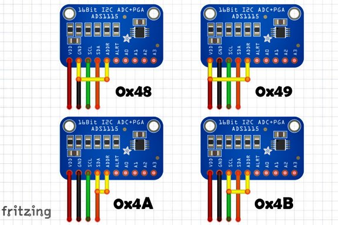
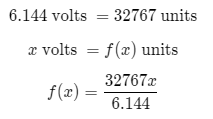
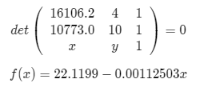

# Módulo ADS1115

Melhor explicação sobre o módulo no vídeo: https://youtu.be/zl7zJAq9nj8

## Power Supply

> 2.0V a 5.5V

## I2C 

O endereço padrão do I2C é o 0x48. Para mudar o endereço, conecta-se o pino **ADDR** num dos outros pinos.

## Voltage Reference

Escolher o **Voltage Range** baseado no sinal analógico de entrada, selecione o alcance acima do sinal, para evitar danificar a placa. Cuidado para não exceder o VDD de referência em 0.3V ou o GND en -0.3V. (VDD+0.3v ou GND-0.3v)

|Voltage Range|Voltage Unit|
|-|-|
|+/- 6.144V | 0.1875mV (default)|
|+/- 4.096V | 0.125mV|
|+/- 2.048V | 0.0625mV|
|+/- 1.024V | 0.03125mV|
|+/- 0.512V | 0.015625mV|
|+/- 0.256V | 0.0078125mV|

## Valores Negativos e Positivos

Este módulo realiza a conversão analógica digital de 16 bits complementao A2, ou seja, 1 bit de sinal e 15 bits de dados. Esta características não se dá devido a tensões negativas, mas por causa da funcionalidade de comparar dois sinais de duas entradas distintas da placa (A0 e A1, por exemplo). Nestas operações, é possível que os resultados deem negativos, logo o formato complemento A2 serve para garantir que todos os valores possívesi sejam reconhecidos.

## Convertendo Valores do ADS no Sensor de pH

### Relação Tensão pH
Durante pesquisas, observei que no arduino UNO as abaixo tensões se relacionavam da seguinte forma com o pH:

|Voltage|pH|
|-|-|
|3.02V|4|
|2.5V|7|
|2.02V|10|

### Convertendo o sinal (Volts) na resposta do ADS

Considerando que o sensor de pH dá respostas de 0v a 5v, a tensão de referência utilizada no ADS foi a de $\pm 6.144$  V. Sabendo que o ADS codifica em complemento A2, então 15 bits serão reservados para valores positivos. Portanto, temos que o menor valor positivo é $0$ e o maior $2^{15}-1 = 32767$. Desta forma, aplicando a regra de três nesta relação, temos que:

[//]: # "$$6.144\ \text{volts}\ = 32767\ \text{units}$$"
[//]: # "$$x\ \text{volts}\ = f(x)\ \text{units}$$"
[//]: # "$$f(x) = \frac{32767x}{6.144}$$"

Utilizando esta função podemos relacionar as unidades do ADS com a relação de tensão em volts. Aplicando esta função na tabela da seção anterior, podemos relacionar a tensão do ph respectivo com o número de unidades do ADS: 

|Voltage|pH|ADS Units|
|-|-|-|
|3.02V|4|16106.2|
|2.5V|7|13332.9|
|2.02V|10|10773.0|

Calculando o a equação da reta (function slope), podemos relacionar a unidades do ADS com valor de pH do sinal do sensor.

[//]: # "$$det\left(\begin{array}{ccc} 16106.2 & 4  & 1\\10773.0 & 10 & 1\\x & y & 1\\\end{array}\right) = 0$$"
[//]: # "$$f(x) = 22.1199 - 0.00112503 x$$"
[//]: # (This may be the most platform independent comment)

Esta função recebe as unidades do ADS e retorna o valor de pH lido pelo sensor.
