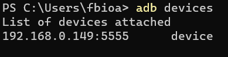
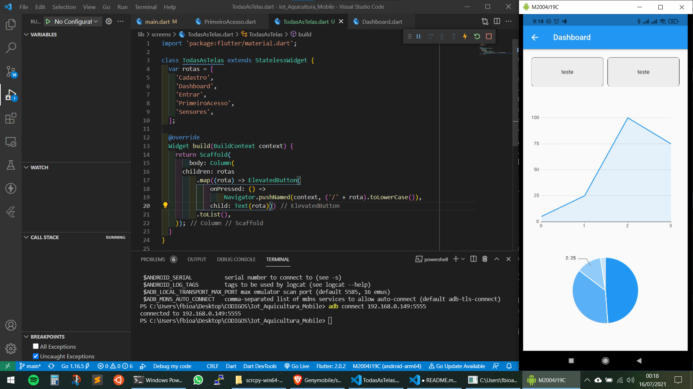

# Desenvolvimento Mobile

Tutorial de como desenvolver em qualquer framework mobile, utilizando seu smartphone e controlando-o de dentro do computador.

# Conectando o ADB do device pelo wifi

### Requisitos
* Modo desenvolvedor ativado no smartphone
* ANDROID_HOME configurado no computador, para acessar o comando **adb**
* Smartphone conectado no mesmo wifi do computador

### Passo a passo
1. Conectar o celular no computador pelo USB
2. Executar no CMD o comando **adb tcpip 5555**, no computador, para habilitar a porta 5555 para conexão wifi
3. Executar no CMD o comando **adb connect [ip do device]:5555**, no computador, para conectar o smartphone ao computador via wifi
4. Desconecte o cabo USB
5. Executar no CMD o comando **adb devices**, no computador, para checar se a conexão foi um sucesso. Se o logo for semelhante a imagem abaixo então tudo ocorreu como esperado

# Controlando Smartphone remotamente

1. Entre no repositório do [scrcpy](https://github.com/Genymobile/scrcpy), e procure no README a opção para baixar e instalar o programa no seu SO (Windows no meu caso)
2. Baixe e execute o programa (o **scrcpy.exe**) no meu caso
3. O programa abrirá um cmd e logo em seguida a tela do seu smartphone pronta para controle remoto.

# Próximos passos

Selecionar na IDE de sua escolha que deseja utilizar o device que acabou de conectar. No exemplo abaixo usei o Vscode, num projeto flutter. É possível escolher o device no canto inferior direito. Selecionei meu Xiaomi Redmi 9 (M2004J19C) e executei o projeto.