## Criar disco com KVM

O KVM permite virtualização de interfaces de dentro da próoria VM. Será importante para a exibição de módulos do projeto que utilizem interface gráfica. 

Execute os comandos abaixo no gcloud, com sua conta e projetos já configurados. Todos os comandos abaixo são referentes ao ubuntu 18.04 LTS.

Criar disco
```
gcloud compute disks create disk-ubuntu-1804-lts \
  --image-project ubuntu-os-cloud \
  --image-family ubuntu-1804-lts \
  --zone southamerica-east1-b
```

Usando disco anterior para criar novo disco com kvm
```
gcloud compute images create kvm-ubuntu-1804-lts \
  --source-disk disk-ubuntu-1804-lts \
  --source-disk-zone southamerica-east1-b \
  --licenses "https://compute.googleapis.com/compute/v1/projects/vm-options/global/licenses/enable-vmx"
```

## Criar VM

De dentro da página da [Google Compute Engine](https://console.cloud.google.com/), selecione seu projeto e siga o seu passo a passo.

1. Clique no menu sanduiche
2. Selecione Compute Engine
3. Selecione Instância de VM 
4. Clice no ícone indicado

5. Preencha o nome da vm e seleciona a região na America do Sul
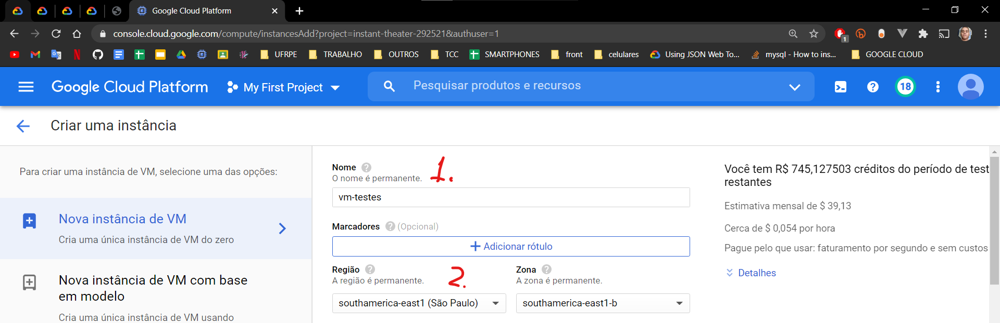
6. Selecione a série da como N1 e tipo de máquina como n1-standard (outras opções tornam o valor da vm maior)
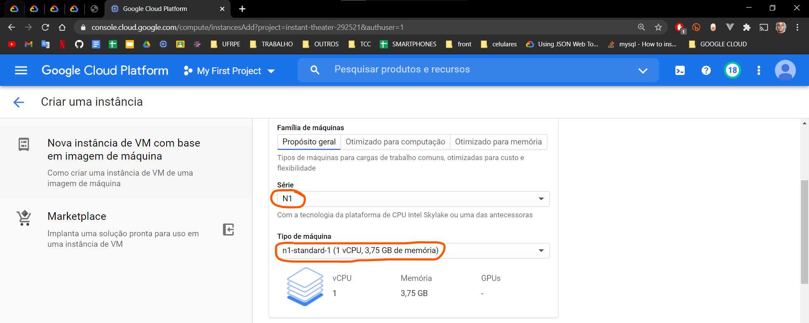
7. Clique no botão indicado
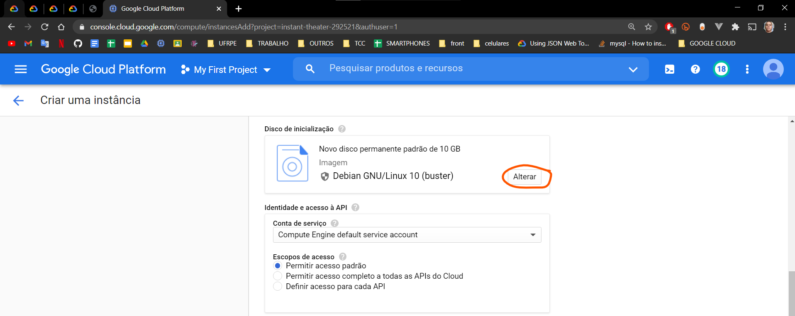
8. Selecione imagens personalizadas, selecione o projeto, selecione o disco com KVM criando anteirormente, indique o tamanho do disco e clique em selecionar.
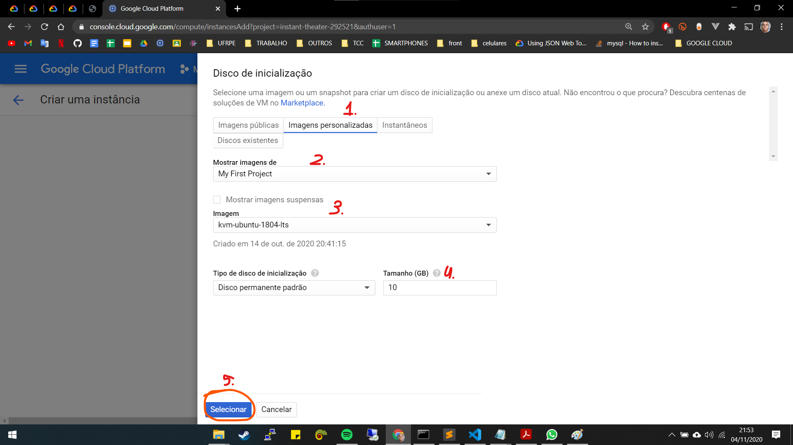
9. Clique no botão indicado

10. Clique em rede, digite "gns3-server" na tag de rede (Esta é a tag representa as configurações do firewall para o servidor gns3)
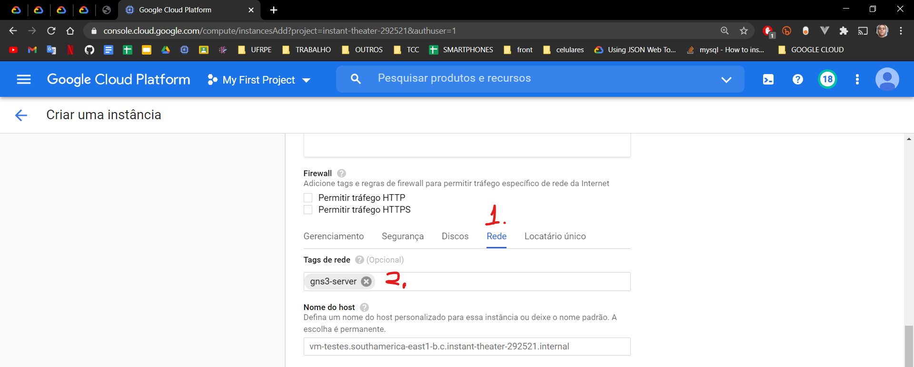
11. Clique no botão indicado para criar a vm
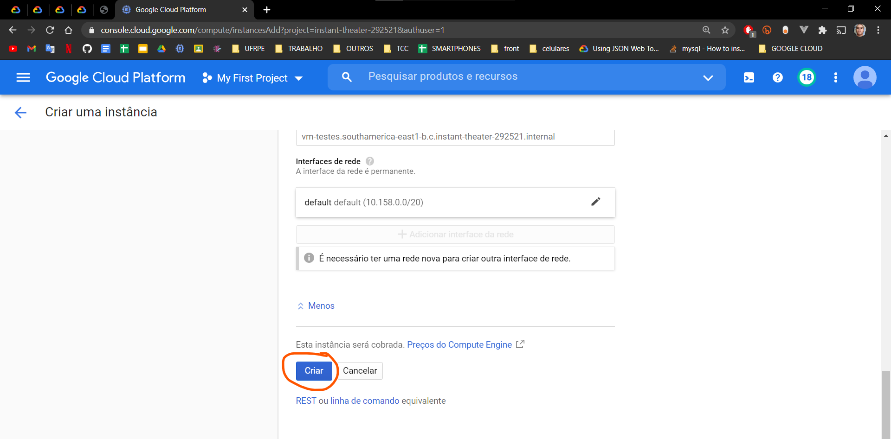

## Atribuir IP estático

De dentro da página da [Google Compute Engine](https://console.cloud.google.com/), selecione seu projeto e siga o seu passo a passo.

1. Clique no menu sanduiche
2. Selecione Rede VPC
3. Selecione Endereços IP externos
4. Clique no dropdown "Temporário"
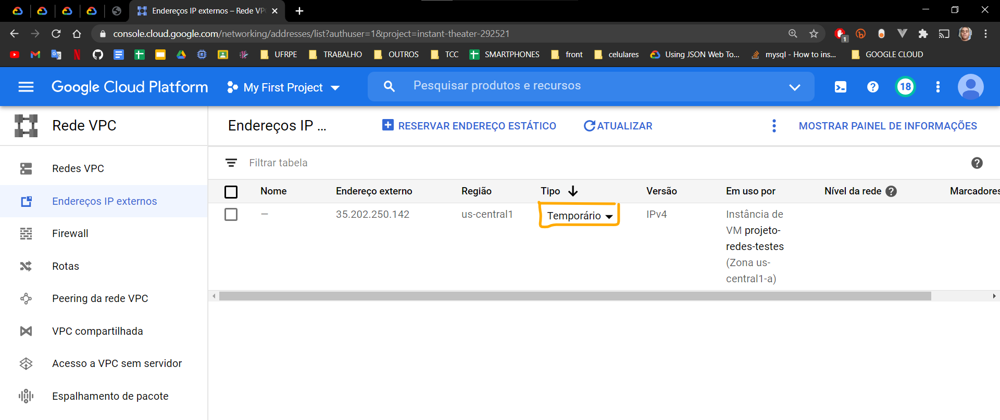
5. Clique em "Estático"

6. Dê um nome ao novo IP estático e clique em "reservar"
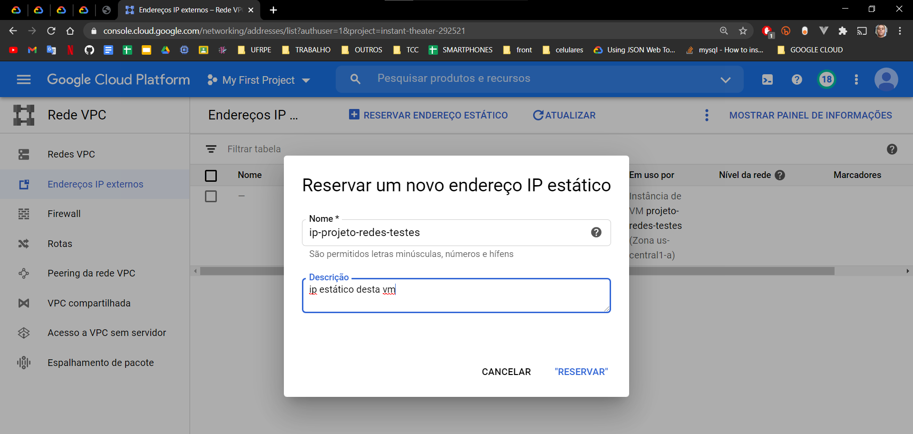

## Configurar firewall

De dentro da página da [Google Compute Engine](https://console.cloud.google.com/), selecione seu projeto e siga o seu passo a passo.

1. Clique no menu sanduiche
2. Selecione Rede VPC
3. Selecione Firewall
4. Clique no botão indicado
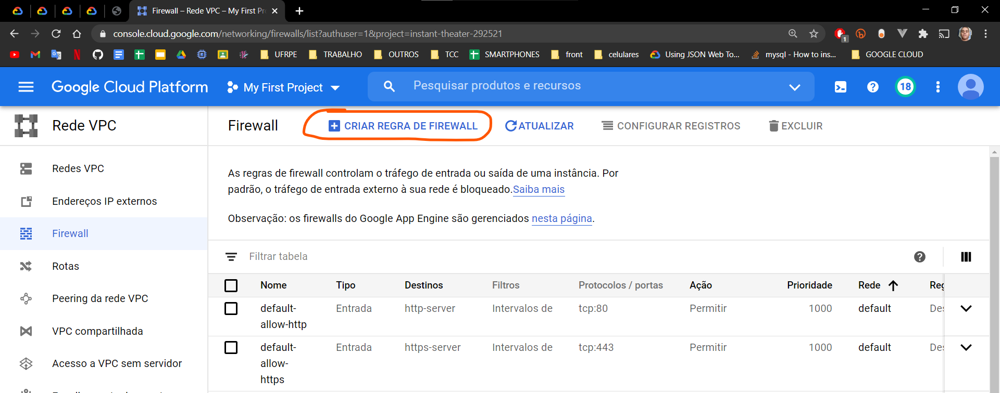
4. Digite o nome da regra como "gns3-server"

5. Digite em tags de destino "gns3-server" e em intervalos de IP de origem digite "0.0.0.0/0"
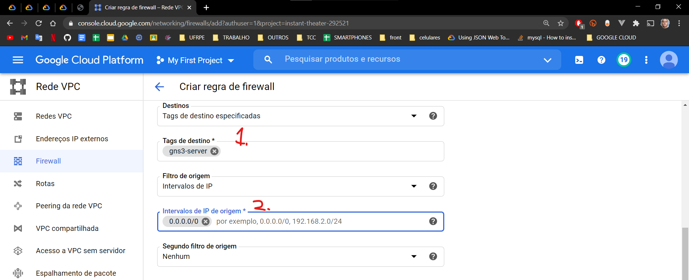
6. Selecione o checkbox tcp e digite "3080,2001-3000,4001-6000", selecione o checkbox udp e digite "10000-11000,20000-30000", clique em criar
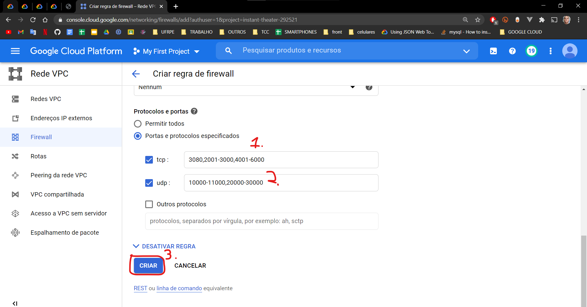

## Adicionar IP ao duckdns

De dentro da página da [Google Compute Engine](https://console.cloud.google.com/), selecione seu projeto e siga o seu passo a passo.

1. Clique no menu sanduiche
2. Selecione Compute Engine
3. Selecione Instância de VM 
4. Copie o ip da VM
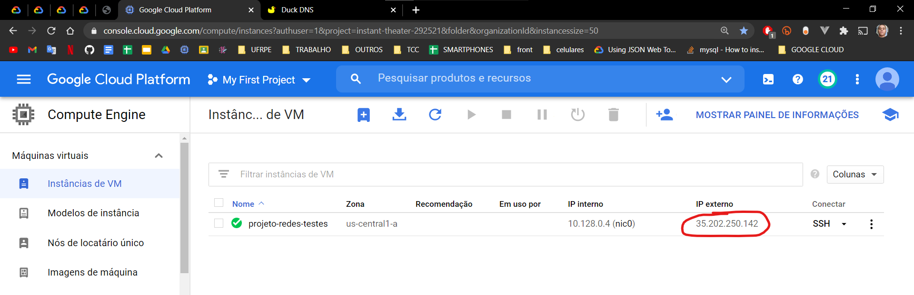
5. Crie uma conta na [duckdns](https://www.duckdns.org/) e a acesse
6. Crie um novo domínio para sua vm. Após estar criado, atualize o ip deste dominio com o ip da sua vm.
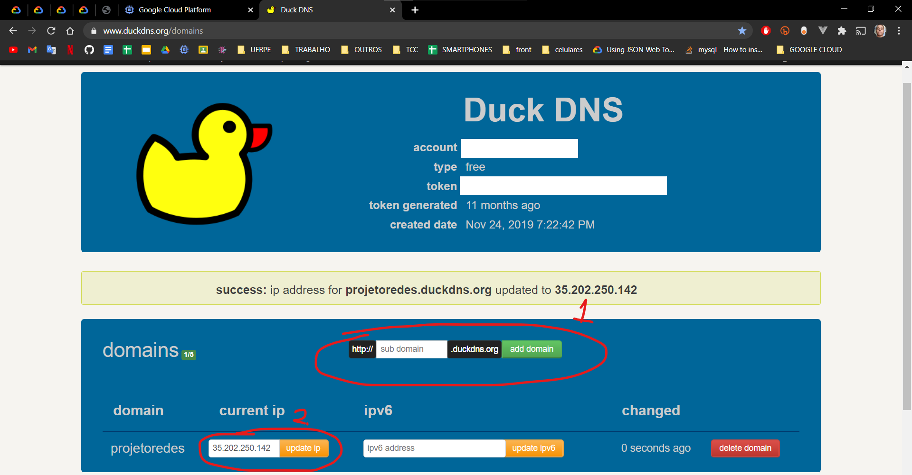

## Configurar SSH

De dentro da página da [Google Compute Engine](https://console.cloud.google.com/), selecione seu projeto e siga o seu passo a passo.

1. Clique no menu sanduiche
2. Selecione Compute Engine
3. Clique em SSH
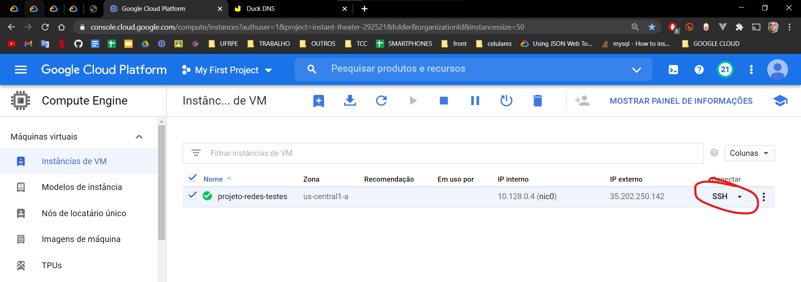
4. Aguarde o console carregar
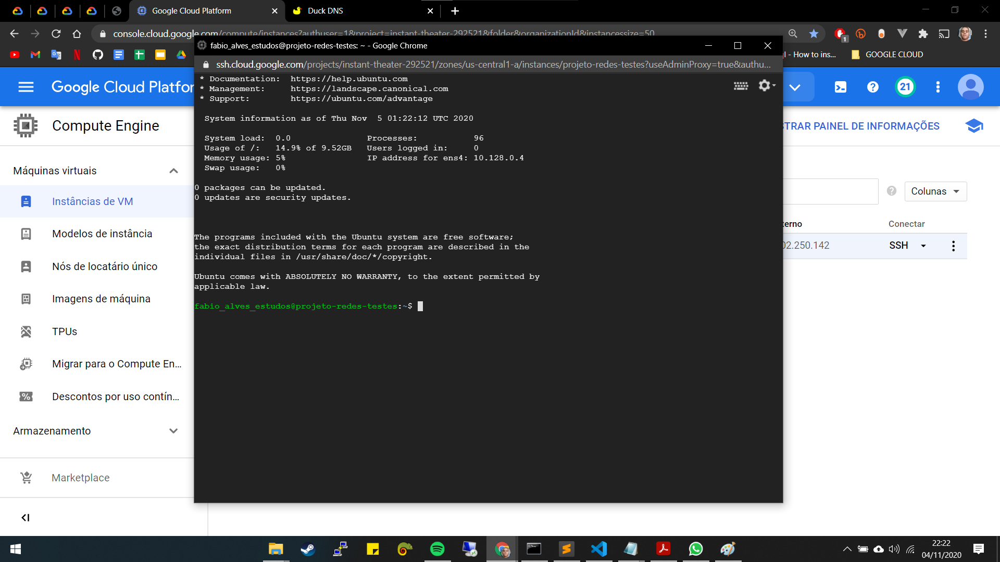
5. Execute os comandos abaixo
```
sudo su
```
6. Execute os comandos abaixo
```
nano /etc/ssh/sshd_config
```
7. Navegue neste arquivo com as setas. Retique o "#" do campo "PermitRootLogin" e substitua o texto "prohibit-password" por "yes". No campo "PasswordAuthentication" substitua o "no" por "yes". Para salvar, selecione CTRL+O e aperte enter. Para fechar, selecione CTRL+C.
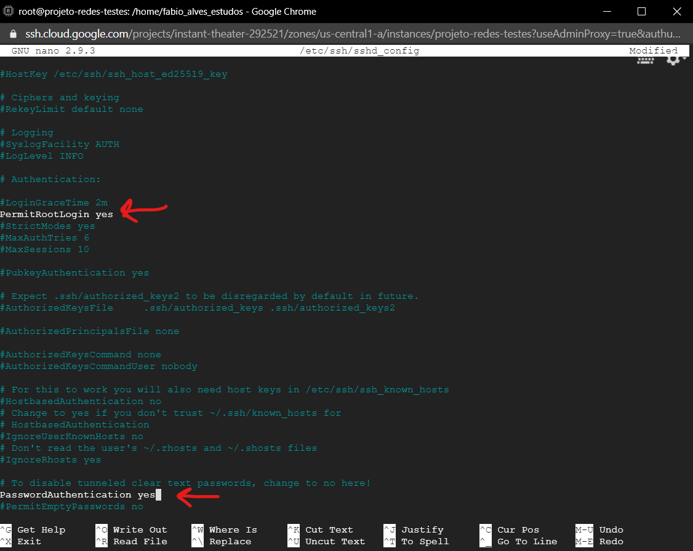
8. Execute os comandos abaixo
```
service sshd restart
```
9. Execute os comandos abaixo
```
passwd root
```
10. Escolha uma senha **FORTE**, pois a VM agora estará exposta à internet. Digite sua senha e aperte enter. Confirma sua senha e aperte enter.

## Acessando a VM em terminal local

1. Abra um terminal em sua máquina
2. Substitua o campo "[ip-ou-dominio]" com o **ip** da sua vm ou seu **domínio do duckdns**.
3. Execute os comandos abaixo
```
ssh root@[ip-ou-dominio]
```
4. Digite a senha configurada para o SSH
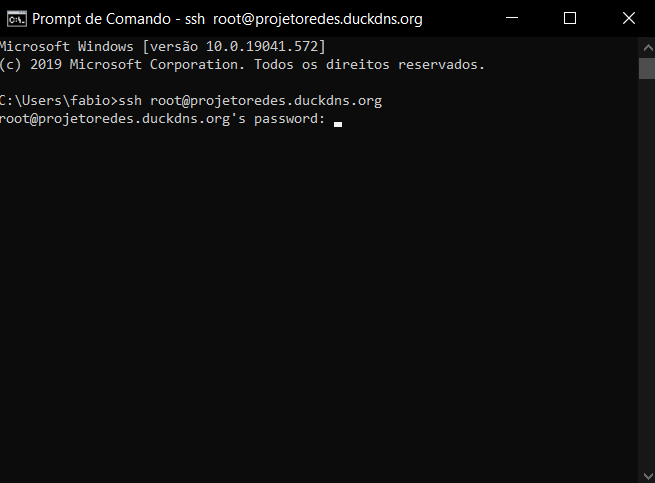

5. Acesso realizado com sucesso
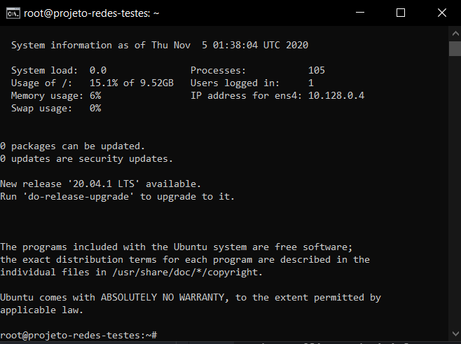

## Instalação do GNS3 server 2.2.3

Alguns comandos abaixo são demorados, aguarde sua execução completa

1. Acesse sua VM num terminal (Passo a passo anterior)
2. Atualizando o gerenciados de pacotes do linux. Execute os comandos abaixo
```
apt-get update -y
apt-get upgrade -y
apt update -y 
apt upgrade -y
```
3. Baixando as dependencias dos arquivos para o servidor gns3. Execute os comandos abaixo
```
apt-get install build-essential git unzip libpthread-stubs0-dev libpcap-dev \
  qemu-kvm libvirt-bin virtinst bridge-utils cpu-checker cmake libelf-dev \
  python3-setuptools python3-aiohttp python3-psutil python3-jsonschema \
  python3.6-dev python3-pip xvfb x11vnc net-rools -y
```
4. Baixando as dependencias dos arquivos para o servidor gns3. Execute os comandos abaixo
```
pip3 install aiohttp multidict==4.5
```
5. Baixando e instalando o ubridge. Execute os comandos abaixo
```
cd ~
git clone https://github.com/GNS3/ubridge.git
cd ubridge
make 
sudo make install
```
6. Baixando e instalando o dynamips. Execute os comandos abaixo
```
cd ~
git clone git://github.com/GNS3/dynamips.git
cd dynamips
mkdir build
cd build
cmake .. -DDYNAMIPS_CODE=stable
sudo make install
```
7. Baixando e instalando servidor gns3 2.2.3. Execute os comandos abaixo
```
cd ~
wget https://github.com/GNS3/gns3-server/archive/v2.2.3.tar.gz
tar xvzf v2.2.3.tar.gz
rm v2.2.3.tar.gz
cd gns3-server-2.2.3/
sudo python3 setup.py install
```
8. Se após esses comandos este log aparecer no terminal, então a instalação foi bem sucedida
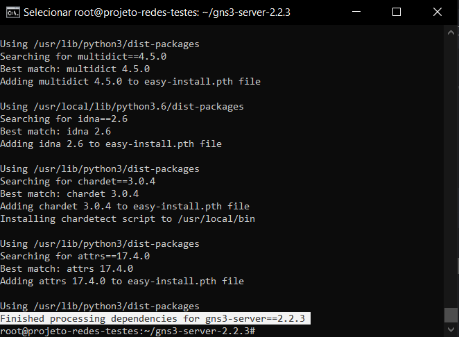


9. Instalação do docker
```
cd ~
sudo apt install docker.io -y
sudo systemctl enable docker
```
10. Criação do usuário gns3
```
sudo adduser gns3
```
11. Digite a senha da sua VM
12. Confirme a senha da sua VM
13. Deixe as demais opções em branco, apenas pressione enter
14. Criação dos usuários **gns3 kvm** e **gns3 docker**
```
sudo adduser gns3 kvm
sudo adduser gns3 docker
```
15. Execute os comandos abaixo
```
sudo cp ~/gns3-server-2.2.3/init/gns3.service.systemd /lib/systemd/system/gns3.service
```
16. Permitindo o serviço do servidor iniciar quando a VM iniciar
```
sudo systemctl enable gns3
```
17. Reiniciando o serviço do servidor
```
sudo systemctl restart gns3
```
18. Checando o status do serviço. Se o log aparecer como na imagem abaixo, então o servidor está pronto para ser utilizado numa interface

```
sudo systemctl status gns3
```
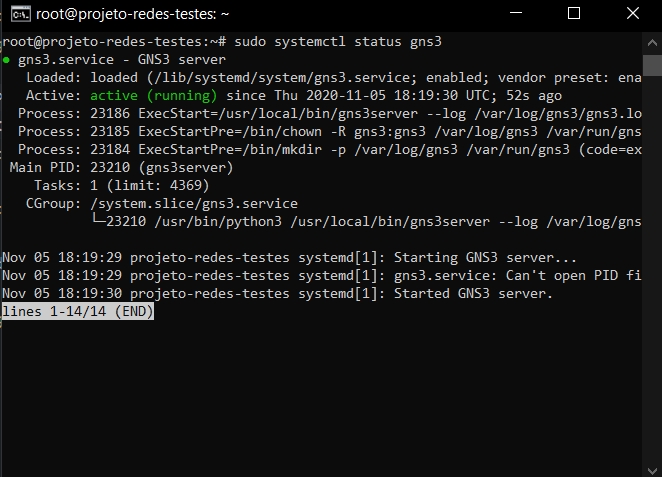

**Observação**: Caso a instalação do servidor falhe, verifique se os comandos foram dados corretamente. Verifique se as dependências do python3 correspondem as indicadas abaixo, se não, então instale-as.
```
aiofiles==0.4.0
aiohttp==3.6.2
aiohttp-cors==0.7.0
asn1crypto==0.24.0
async-generator==1.10
async-timeout==3.0.1
attrs==17.4.0
Automat==0.6.0
blinker==1.4
certifi==2018.1.18
chardet==3.0.4
click==6.7
cloud-init==20.3
colorama==0.3.7
command-not-found==0.3
configobj==5.0.6
constantly==15.1.0
cryptography==2.1.4
distro==1.5.0
distro-info===0.18ubuntu0.18.04.1
gns3-server==2.2.3
google-compute-engine==20190801.0
httplib2==0.9.2
hyperlink==17.3.1
idna==2.6
idna-ssl==1.1.0
incremental==16.10.1
Jinja2==2.10
jsonpatch==1.16
jsonpointer==1.10
jsonschema==2.6.0
keyring==10.6.0
keyrings.alt==3.0
language-selector==0.1
MarkupSafe==1.0
multidict==4.5.0
netifaces==0.10.4
oauthlib==2.0.6
PAM==0.4.2
psutil==5.6.3
pyasn1==0.4.2
pyasn1-modules==0.2.1
pycrypto==2.6.1
pygobject==3.26.1
PyJWT==1.5.3
pyOpenSSL==17.5.0
pyserial==3.4
python-apt==1.6.5+ubuntu0.3
python-debian==0.1.32
pyxdg==0.25
PyYAML==3.12
raven==6.10.0
requests==2.18.4
requests-unixsocket==0.1.5
SecretStorage==2.3.1
service-identity==16.0.0
six==1.11.0
ssh-import-id==5.7
systemd-python==234
Twisted==17.9.0
typing-extensions==3.7.4.3
ufw==0.36
unattended-upgrades==0.1
urllib3==1.22
yarl==1.3.0
zope.interface==4.3.2
```

## Baixando o GNS3 GUI

A interface será utilizada para acessar o servidor da nuvem. Para baixar basta acessar [este link](https://github.com/GNS3/gns3-gui/releases/download/v2.2.3/GNS3-2.2.3-all-in-one.exe). É importante que a versão da GUI seja a mesma do Servidor, caso contrário não funcionará. Baixe, execute e siga os passos de instalação do arquivo deixando todas as checkboxes no padrão..

## Configurando Interface

Abra o GNS3. De vez em quando ele indica novas versões da interface e dá a sugestão da atualizá-la. Não faça isso, pois ela ficará numa versão diferente do servidor.

1. Clique em Edit
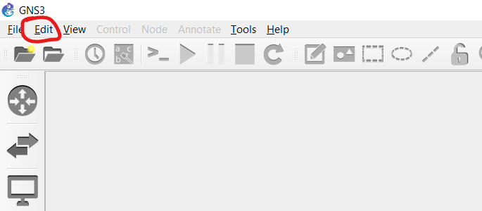
2. Clique em Preferences
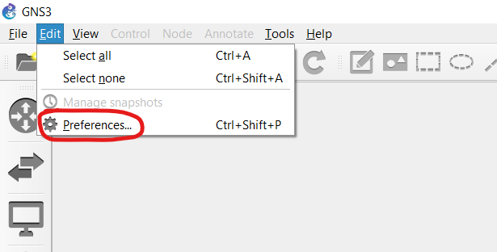
3. Clique em Server e desabilite a checkbox "Enable Local Server"
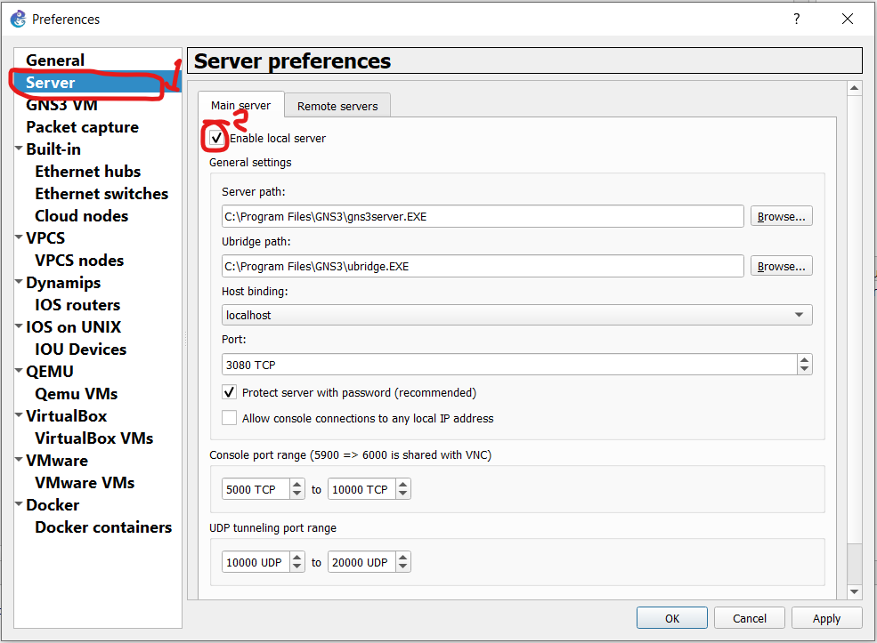
4. No campo host, digite seu domínio do duckdns.
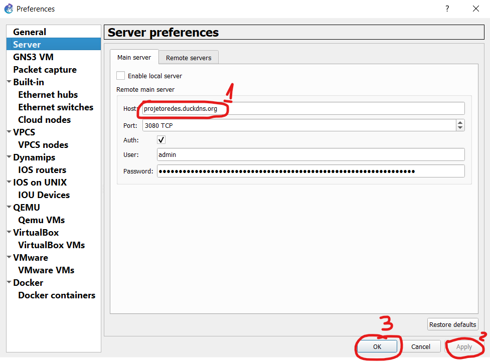
5. Se no servidor da interface aparecer o nome da VM, então a configuração está correta
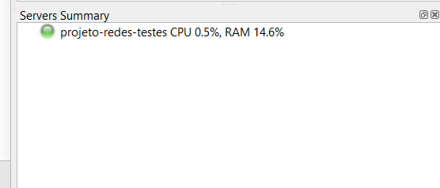

## Instalando Imagens da CISCO no Dynamips

1. Abra sua VM no terminal
2. Execute os comandos abaixo
```
mkdir /home/gns3/GNS3/images/IOS
cd /home/gns3/GNS3/images/IOS
```
3. Baixando as imagens da cisco
```
wget http://tfr.org/cisco-ios/7200/c7200-adventerprisek9-mz.124-24.T5.bin

wget http://tfr.org/cisco-ios/37xx/3745/c3745-adventerprisek9-mz.124-25d.bin

wget http://tfr.org/cisco-ios/37xx/3725/c3725-adventerprisek9-mz.124-15.T14.bin
```
4. Descompactando as imagens e deletando os arquivos compactados
```
unzip -p c7200-adventerprisek9-mz.124-24.T5.bin > c7200-adventerprisek9-mz.124-24.T5.image

unzip -p c3745-adventerprisek9-mz.124-25d.bin > c3745-adventerprisek9-mz.124-25d.image

unzip -p c3725-adventerprisek9-mz.124-15.T14.bin > c3725-adventerprisek9-mz.124-15.T14.image

rm *.bin
```

## Importando Switchs e Etherswitchs

1. Dentro do GNS3, clique em **Edit > Preferences > Dynamips > IOS routers**
2. Cliquei em New
3. Neste dropdown aparecerá as imagens baixadas anteriormente, escolha a que deseja importar e clique em next
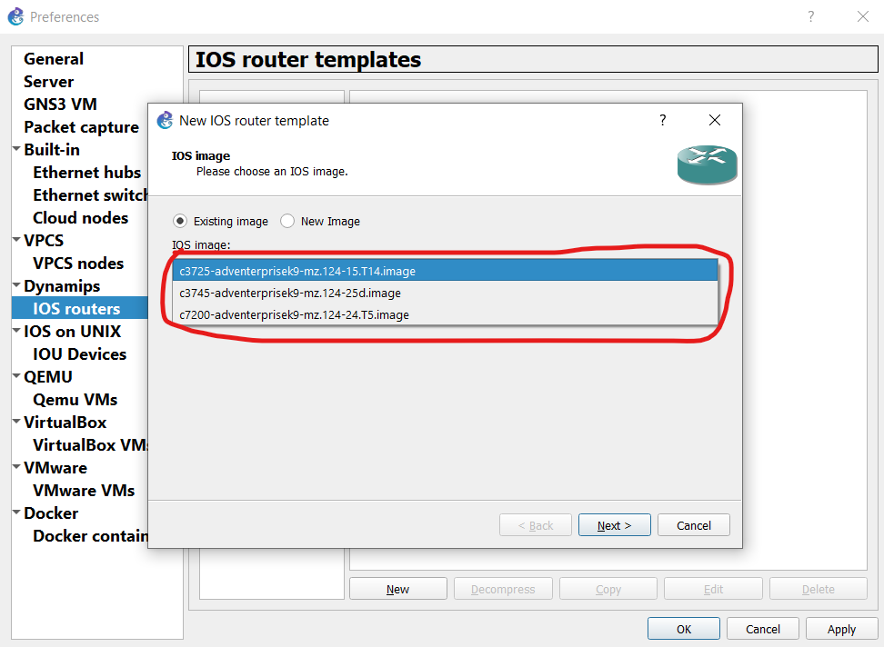
4. Digite o nome da sua instância ou deixe em branco (nome default)
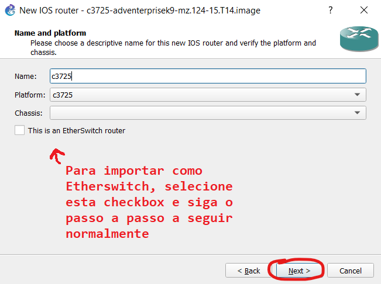
5. Clique em Next
6. Nesta tela você poderá escolher as interfaces de rede da instância. Escolha da forma que mais lhe agradar e clique em Next.
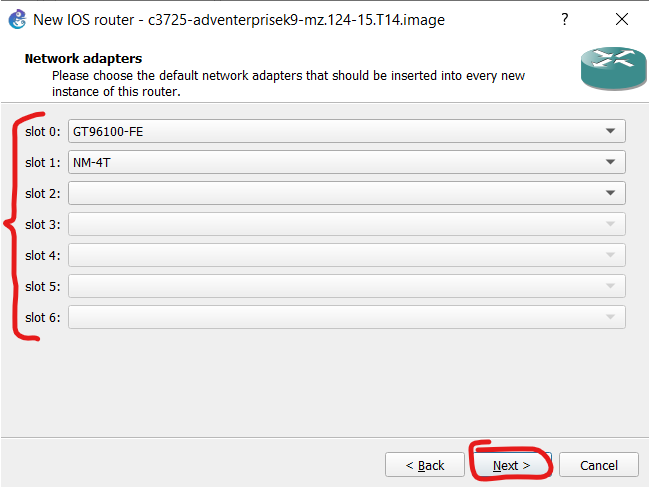
7. Clique em Next
8. Clique em Finish

## Instalando containers docker para instâncias linux

> Para buscar imagens acesse a [conta do gns3 no docker hub](https://hub.docker.com/search?q=gns3&type=image) ou o [appliances do marketplace do gns3](https://gns3.com/marketplace/appliances)

| Nome da Imagem  | Descrição  |
|---|---|
| fabioafreitas/ubuntu_python3:latest  | Imagem do python3 com conector mysql, flask, flask_cors e conector mysql |
| fabioafreitas/ubuntu_network_tools:latest  | Imagem com nmap, client ssh, server ssh, net-tools, iptables, ufw, etc instalados  |
| fabioafreitas/ubuntu_mysql:latest  | Imagem com o banco de dados relacional mysql instalado  |
| fabioafreitas/ubuntu_mongodb:latest  | Imagem com o banco de dados não relacional mongodb instalado  |
| fabioafreitas/ubuntu_dnsmasq:latest  | Imagem com o servidor dns dnsmasq instalado  |
| fabioafreitas/ubuntu_bind9:latest  | Imagem com o servidor dns bind9 instalado  |
| fabioafreitas/ubuntu_apache2:latest  | Imagem com o servidor apache2 instalado  |
| fabioafreitas/alpine_python3:latest  | Imagem com python3 instalado  |
| fabioafreitas/alpine_php7:latest  | Imagem com php7 instalado  |
| fabioafreitas/alpine_nodejs:latest  | Imagem com nodejs 12 instalado  |
| fabioafreitas/alpine_java8:latest  | Imagem com java 8 instalado  |
| fabioafreitas/alpine_c_cpp:latest  | Imagem com c e c++ instalados  |

1. Dentro do GNS3, clique em **Edit > Preferences > Docker > Docker containers**
2. Clique em New
3. Selecione New Image e digite o nome da imagem
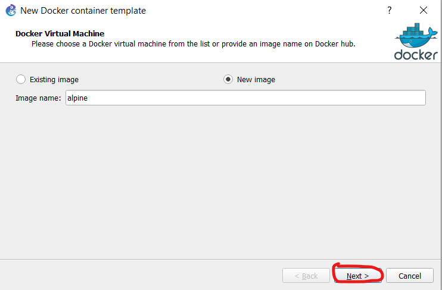
4. Clique Next e Finish para o resto das configurações
5. Clique em **File > New Blank Project**
6. Digite o nome do projeto
7. Clique em OK para criar o projeto
8. Arraste a instância do docker instalado anteriormente no seu projeto, para que os dados do container sejam baixados. Após o download, ela estará pronta para ser utilizada.
