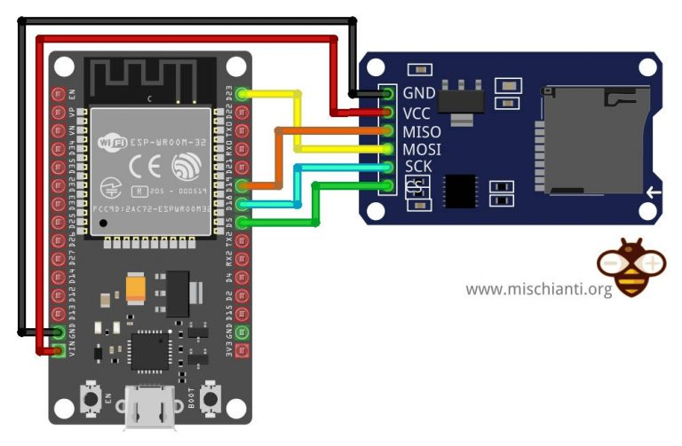
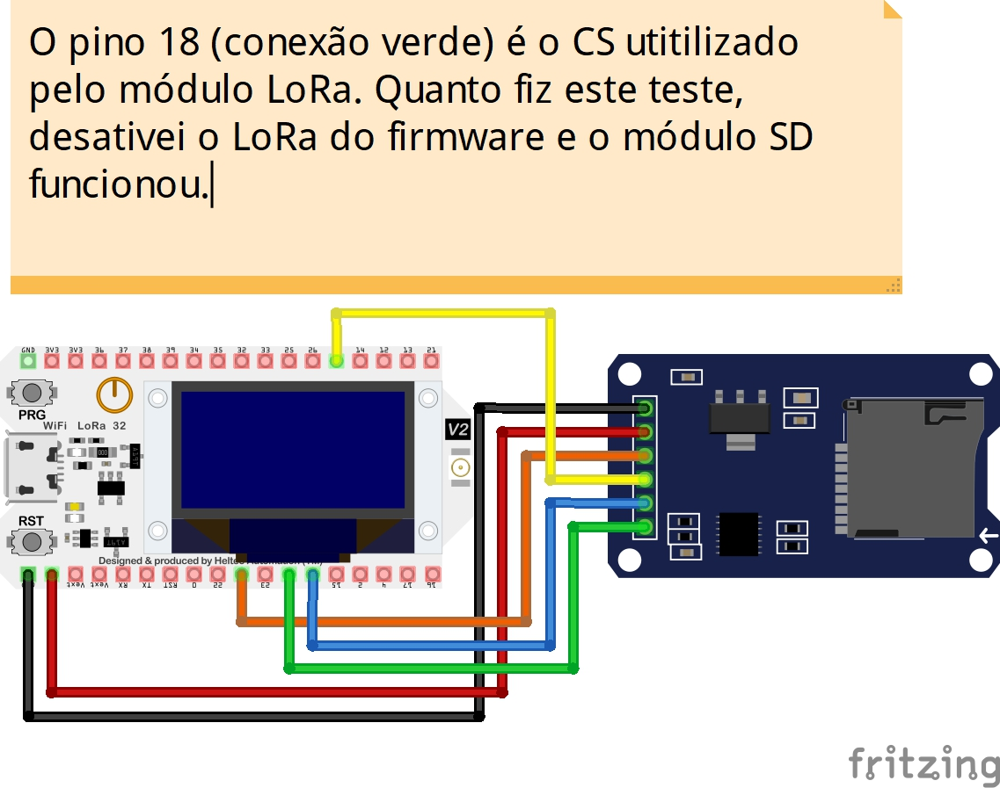
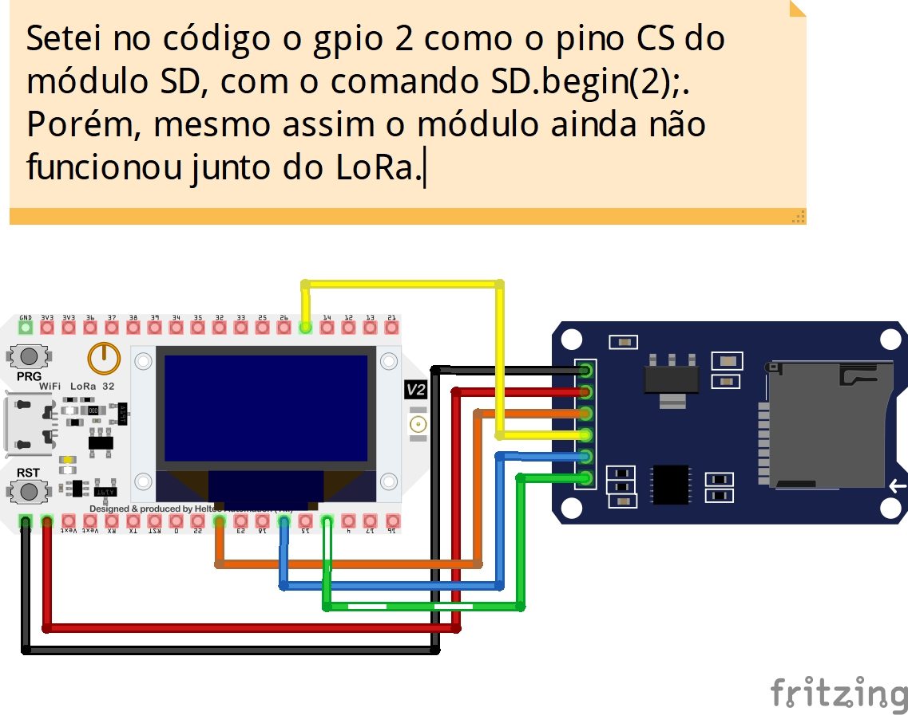

# SD Card Module

Este artigo explica o que pesquisei e aprendi até o momento sobre a integração do módulo HW-125, que é uma interface embarcada para integrar Cartões de Memória SD em arduinos e ESPs.

## SPI

Ela usa o protocolo serial SPI, que semelhante ao I2C, permite múltiplos módulos conectados ao mesmo barramento de dados (MOSI - Master Out Slave In, MISO - Master In Slave Out), que funcionam sob o clock determinado pelo pino CLK. A grande diferença está no pino CS (Chip Select), também chamado de SS (Slave Select), que representa o endereçamento da placa. Por padrão todos os módulos conectados oa SPI estão com o SS em nível lógico alto, e quando o master (Microcontorlador), reduz o nível lógico de um dos SSs para nivel baixo, significa que ele poderá se comunicar com o mesmo.

## SPI vs I2C

O I2C é half duplex, ou seja, a informação só pode ser enviada num sentido por vez. Já o SPI é full-duplex, pois o Master envia pelo MOSI e o Slave pelo MISO. 

## SD Card e ESP32 WROOM 32

[Tutorial](https://www.mischianti.org/2021/03/28/how-to-use-sd-card-with-esp32-2/)

Peguei o primeiro código disponibilizado pelo autor do link acima e o testei no meu ESP32. Funcionou perfeitamente.

## SD Card e Heltec LoRa v2

Ajustei o código anterior, como mostrado no seguinte [link](https://github.com/fabioafreitas/Arduino/blob/master/sdcard/comandos_utilitarios/comandos_utilitarios.ino). Nele, eu utilizei o seguinte o pinout padrão do Heltec LoRa v2 para conexões SPI, como mostra a imagem abaixo. 

Como dito na descrição da imagem, o pino 18 é o CS do LoRa desta placa, logo, outor módulo não pode estar endereçado neste pino sob o SPI, outro pino deve ser escolhido para a placa executar ambos os devices SPI simultanetamente. Na imagem abaixo eu fiz justamente isso, troquei o CS do SD module para o GPIO 2. Mesmo assim, o LoRa ainda não funcionou em conjunto.

## Links que podem conter a solução - Preciso analisar com cuidado depois

* [How to use 2 SPI devices, LoRa and SD Card, on ESP32?](https://stackoverflow.com/questions/57454066/how-to-use-2-spi-devices-lora-and-sd-card-on-esp32) - Embora tenha escrito ESP32, ele usa o Heltec LoRa v2.

* [Trying to share SPI-bus with LoRa and Epaper-display (Waveshare 2,9”)](http://community.heltec.cn/t/trying-to-share-spi-bus-with-lora-and-epaper-display-waveshare-2-9/251)

* [SPI with multiple devices attached – Arduino, Heltec WiFi Lora 32 and RFID-RC522](https://iotline.eu/spi-with-multiple-devices-attached-arduino-heltec-wifi-lora-32-and-rfid-rc522/)

* [How to define the SPI pins in an ESP32 module?](https://electronics.stackexchange.com/questions/451707/how-to-define-the-spi-pins-in-an-esp32-module) - Embora tenha escrito ESP32, ele usa o Heltec LoRa v2.

* [ESP 32 LORA with another SPI](http://community.heltec.cn/t/esp-32-lora-with-another-spi/1262) - Embora tenha escrito ESP32, ele usa o Heltec LoRa v2.

## Outros Links Usados Durante o Estudo

* [Heltec LoRa V2 - Pinout](https://resource.heltec.cn/download/WiFi_LoRa_32/WIFI_LoRa_32_V2.pdf) - Aprendi que os GPIOs 32 acima desta placa são **input only**

* [How to use SD card with esp32 – 2](https://www.mischianti.org/2021/03/28/how-to-use-sd-card-with-esp32-2/) - Tirei os códigos de exemplo deste link. Ele ensina no ESP32 WROOM 32.