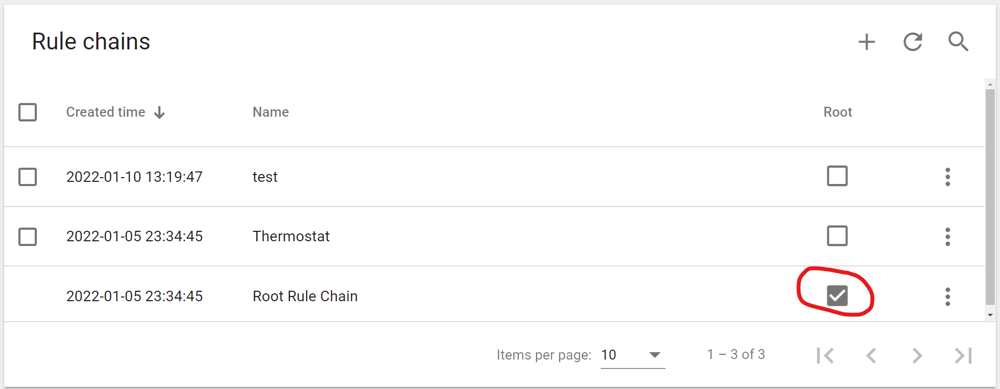
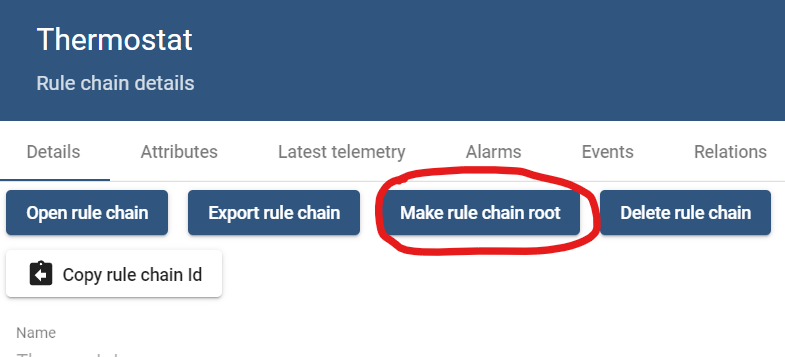
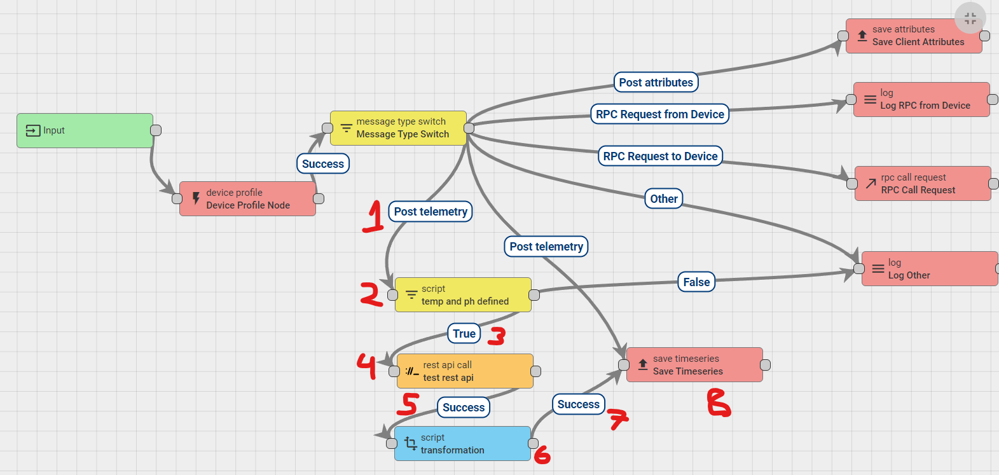
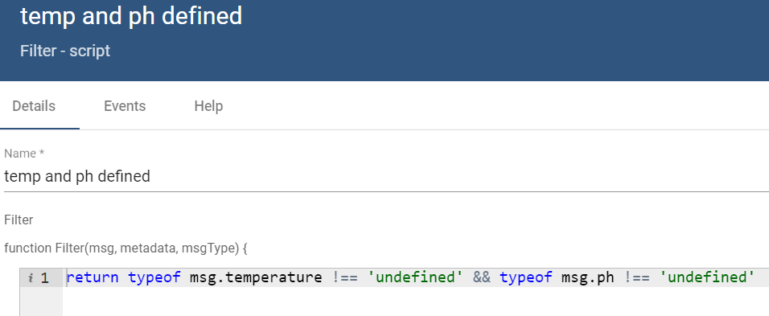
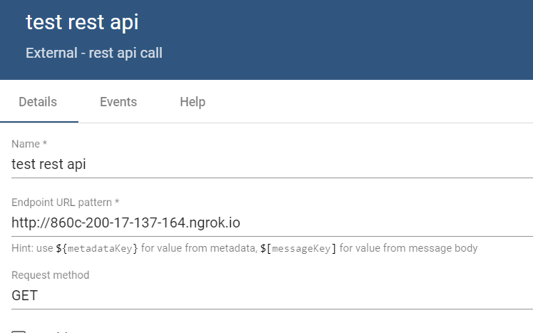
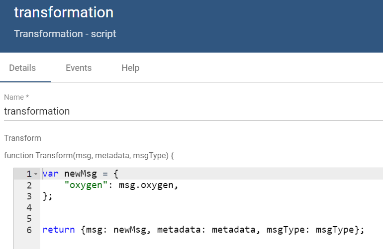

# Thingsboard

## Código Python Para Baixar Dados Históricos

[link](./get_historical_data_thingsboard.py)

- [TODO] testar se o campo limit deixa a api baixar todos os dados do servidor de uma única vez

## [Get JWT](https://thingsboard.io/docs/reference/rest-api/#jwt-tokens)

```
curl -X POST --header 'Content-Type: application/json' --header 'Accept: application/json' -d '{"username":"tenant@thingsboard.org", "password":"tenant"}' 'http://thingsboard.smartrural.com.br/api/auth/login'
```

O JWT deve ser escrito como: **Bearer [jwt]**

## [Get Historical Data From Device](https://thingsboard.io/docs/user-guide/telemetry/#get-historical-time-series-data-values-for-specific-entity)

baixar dados historicos de um device. Os valores a serem baixados devem estar dentro de um intervalo de tempo, no formato unix. Para obter datas neste formato use o seguinte [link](https://www.unixtimestamp.com/).

```
curl -v -X GET 'http://thingsboard.smartrural.com.br/api/plugins/telemetry/DEVICE/ad7b0610-6ef0-11ec-8d73-4f02d9360166/values/timeseries?keys=temperature&startTs=1609815599000&endTs=1641494074866' \
--header "Content-Type:application/json" \
--header "X-Authorization: $JWT_TOKEN"
```

## Publish MQTT

é necessário apenas identificar o device por seu $ACCESS_TOKEN, que pode ser obtido na aba _details_ do device.

```
mosquitto_pub -d -q 1 -h "thingsboard.smartrural.com.br" -t "v1/devices/me/te
lemetry" -u "$ACCESS_TOKEN" -m "{"temperature":42}"
```

## Websockets Telemetry

ver o arquivo [thingsboard_websockets.html](./thingsboard_websockets.html)

## Rule Chains

Apenas a root rule chain receberá os dados de entrada do thingsboard, as demais não receberão. 

A imagem abaixo mostra como identificar a **root rule chain** atual:



A imagem abaixo mostra como trocar a rule chain:




### Requisição HTTP e salvando resposta em device

Links importantes que pesquisei para aprender este conceito:
- [sobre bloco REST API Call Node](https://thingsboard.io/docs/user-guide/rule-engine-2-0/external-nodes/#rest-api-call-node)
- [Como transformar dados de entrada e enviá-los ao seu device origem](https://thingsboard.io/docs/user-guide/rule-engine-2-0/tutorials/transform-incoming-telemetry/)
- [Como tratar a resposta JSON do bloco REST API Call Node na rule chain](https://thingsboard.io/docs/user-guide/rule-engine-2-0/tutorials/get-weather-using-rest-api-call/#node-e-script-transformation-node)

Este exemplo mostra a chamada da rede neural e o salvamento da predição do OD no device que recebeu dados de ph e temperatura. A imagem abaixo mostra o esquema utilizado neste exemplo:



Esta é a root rule chain padrão que vem instalado no thingsboard inicialmente. Eu modifiquei a parte com os números em vermelho, para tratar a chamada da api da rede neural. O bloco **message type switch** direciona diferentes os diferentes eventos de entrada do thingsboard, cabe ao desenvolvedor usar os eventos nomeados nas setinhas para programar o comportamento desejado. Este exemplo funciona assim:

1. Chega uma nova mensagem de um device no server, que é encaminhado a seta 1, de **Post Telemetry**, através do **message type switch**.

2. Um bloco script verifica se na nova menssagem, as keys "temperature" e "ph" estão definidos, pois se sim, uma chamada a API deve ocorrer. O detalhe é que dentro do corpo do JSON desta requiição é necessário ter o device-id do dispositivo em questão, para que a API de estimação do OD possa identificá-lo. Este dado deve ser passado pelo próprio esp32/arduino/generator que gerou o dado de ph e temperatura, ou seja, o json deve estar no seguinte formado

  ```
  {
  "ph":7.1,
  "temperature":29.1,
  "deviceid":"754bcc50-f9a3-11ec-bf91-e96cef9e8ef0"}
  ```
  


3. Se ambas as chaves estiverem definidos, a resposta do bloco script será "true", e a mensagem será enviada ao bloco **rest api call**.

4. É realizada uma chamada http ao servidor da API, que retornará a predição do OD. Na imagem abaixo mostra todo o conteudo que modifiquei neste bloco. No teste que fiz eu criei um servidor flask e o expus com o ngrok. O servidor tinha uma rota GET no "/" e retornada um json no seguinte formato: {"oxygen":6}.



5. Se a requisição for bem sucedida "200 ok", então a resposta do json é enviada ao bloco script azul, para ser tratada

6. Neste bloco, ocorre a formatação de um novo envio de dados ao device que recebey os dados no passo 1. Este processo de identificar o device já é realizado pela própria thingsboard, não há com o que se preocupar. A única modificação é no campo "msg", que recebe o json com os dados a serem enviados ao device. Neste caso, a predição de OD oriunda da resposta da API.



7. Caso o thingsboard modifique os dados corretamente, a seta retorna sucesso e a nova mensagem modificada ao bloco seguinte

8. Este bloco salva os dados no banco de dados e no respectivo device inicial, finalizando o processo.

## [BACKUP](https://groups.google.com/g/thingsboard/c/Me4w7zeaVmM)


On the first computer, backup the database using postgres dump tool:
```
pg_dump thingsboard --host=localhost --username postgres -W > thingsboard.dump
```
Then, backup the /etc/thingsboard/conf directory:
```
sudo tar cvfz tb.tar.gz /etc/thingsboard/conf/*
```
Copy thingsboard.dump and tb.tar.gz to the new computer. On the new computer, with a fresh install of Thingsboard as per the posted instructions:

Stop Thingsboard, then:
```
sudo su postgres
dropdb thingsboard # this removes the database
createdb -T template0 thingsboard
psql thingsboard -U postgres -W < thingsboard.dump
```
Copy the /etc config files:
```
cd /
sudo tar xvfz /home/ubuntu/tb.tar.gz
```
Start Thingsboard.
